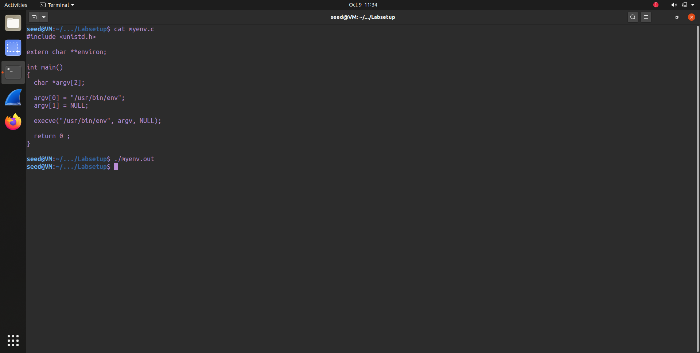
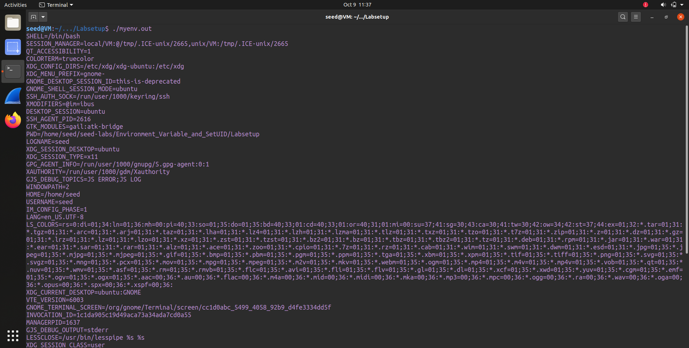
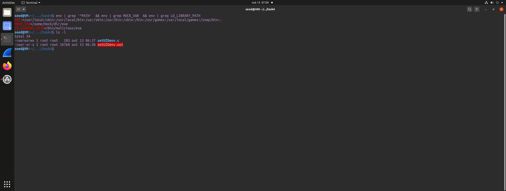
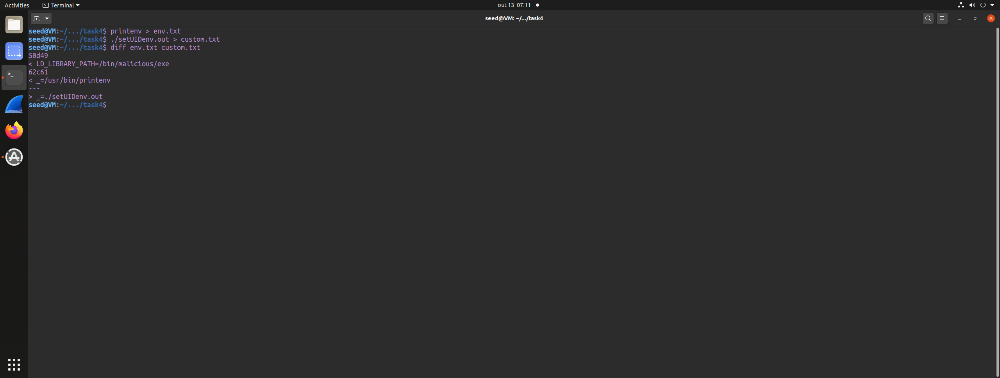
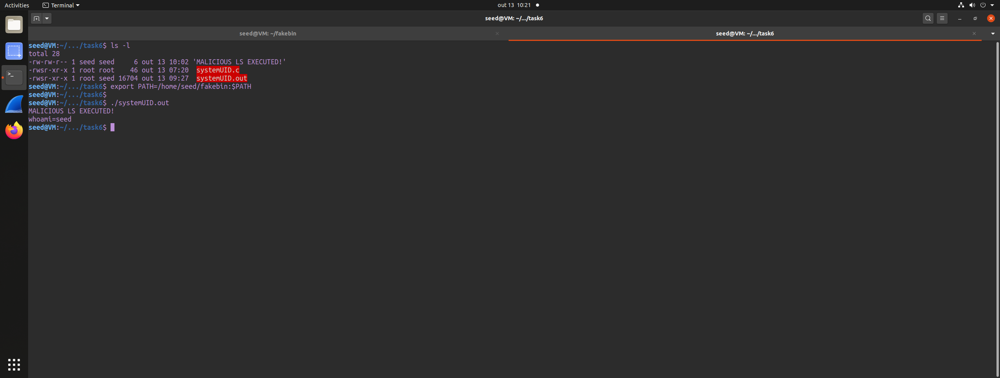
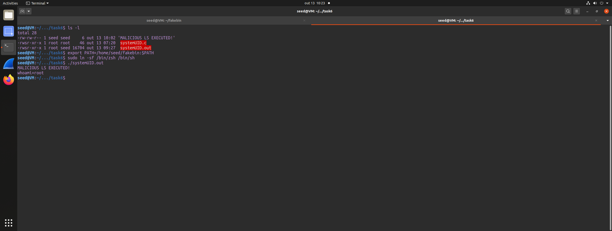
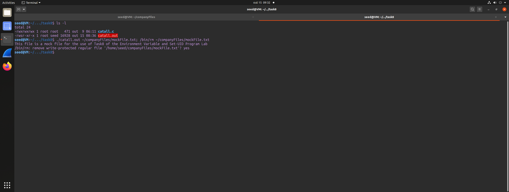
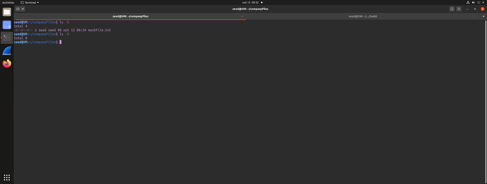
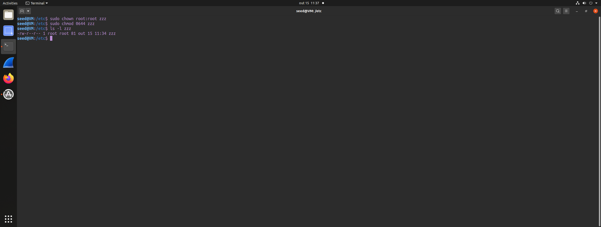
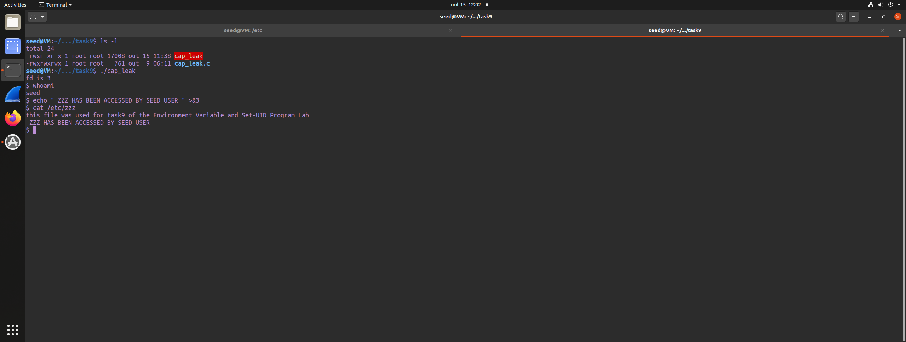

That's a detailed logbook about experiments with environment variables and security in Linux! Here is the content organized and formatted using **Markdown**:

---

## **Environment Variables and Set-UID Programs Lab Logbook**

### **Task 1: Basic Environment Variable Management**


### **Task 3: Environment Variables and `execve()`**

When we call execve(), we replace the current process with a new program. In doing so, we provide three arguments:
When invoking `execve()`, three arguments are provided:

1. **Path to the executable**: The absolute path of the program to run (e.g., `/usr/bin/env`).
2. **Arguments**: An array of strings representing the command-line arguments for the executable.
3. **Environment variables**: An array specifying the environment for the new program.

In the first step, we pass the executable `/usr/bin/env`, which is responsible for printing all the environment variables. However, we provide the new program with a `NULL` environment, so when it runs, it prints nothing — as expected.



In step two, when we pass our current environment variables as the third argument to the new program, running it displays all the environment variables of our process — exactly as expected.




---

### **Task 4: Environment Variables and `system()`**


### **Task 5: Environment Variables and Set-UID Programs**

We started by creating a C program called `setUIDenv.c`. After compiling the code, we changed its ownership to `root` and set the **setuid** bit to grant it root privileges. Next, we exported the environment variables `LD_LIBRARY_PATH` and `MOCK_PATH`, setting them to point to our custom mock executables. This setup allowed us to observe how environment variables can influence the behavior of privileged programs and test potential security implications.



Afterward, we use the `printenv` command to save the environment variables to a file named `env.txt`, and then execute our target script, redirecting its output to `custom.txt`. This allows us to compare the two files and observe the exact differences between the environments.



Linux intentionally ***sanitizes certain environment variables*** for privileged (Set-UID/Set-GID) processes to prevent privilege escalation via dynamic loader tricks and other environment-driven attacks.
`LD_LIBRARY_PATH` and similar loader-related variables are treated as dangerous and are removed or ignored for Set-UID programs.

Arbitrary user-defined environment variables (e.g., `MOCK_PATH`) are ***not inherently dangerous from the kernel’s perspective*** and therefore are passed through — so they remain visible to Set-UID processes unless the program itself clears or filters them.


---

### **Task 6: The `PATH` Environment Variable and Set-UID Programs**

For this lab, we investigated how environment variables affect Set-UID programs. We compiled the supplied C program that calls `system("ls")`, then created a directory `/fakebin` containing a malicious `ls` script:

```
echo "MALICIOUS LS EXECUTED!"
echo "whoami=$(whoami)"
```

We prepended `/fakebin` to `PATH` so the shell invoked by `system()` would find our fake `ls` first. With `/bin/sh` pointing to the default `dash`, our malicious `ls` executed, but it did not run with root privileges. This is because `dash` detects that it is running in a Set-UID context and drops the effective UID, preventing privilege escalation.

After replacing `/bin/sh` with `zsh` (which lacks that countermeasure), running the Set-UID program again caused our fake `ls` to execute ***as root*** — `whoami` reported `root`. This demonstrates that (1) `system()` is dangerous in Set-UID programs because the invoked shell and environment can be controlled by an attacker, and (2) some shells (like `dash`) mitigate this by dropping privileges, while others (like `zsh`) do not.


**Malicious ls setup**  

1. **Attack Attempt in `dash`**


2. **Attack Attempt in `zsh`**



---


### **Task 8: Invoking External Programs Using `system()` versus `execve()`**

We initially evaluated `PATH` manipulation to substitute a malicious `cat` binary, but this attack vector is not feasible because the application calls `/bin/cat` directly. Attempts to influence dynamic loader behavior via `LD_*` environment variables are likewise ineffective in this context, since privileged execution typically causes those variables to be ignored or sanitized. The core issue is that untrusted user input is interpolated into a shell command and executed via `system()`. Because `system()` invokes a shell, unsanitized input can be interpreted as additional shell syntax, enabling command injection that inherits the process’s privileges.

1. **Task 8 - `system()` command injection**

2. **Task 8 - Final attack result**


---

### **Task 9: Capability Leaking**

Before starting Task 9, we create a target file `/etc/zzz`. This file is owned by `root` and it has permissions `0644`, so an unprivileged user (here, `seed`) cannot normally modify it. We gave this file the following content: 

 -```this file was used for task9 of the Environment Variable and Set-UID Program Lab```.



After that we get a script in c that does the following 

```c
void main()
{
    int fd;
    char *v[2];

    /* Assume that /etc/zzz is an important system file,
     * and it is owned by root with permission 0644.
     * Before running this program, you should create
     * the file /etc/zzz first. */
    fd = open("/etc/zzz", O_RDWR | O_APPEND);
    if (fd == -1) {
        printf("Cannot open /etc/zzz\n");
        exit(0);
    }
    // Print out the file descriptor value
    printf("fd is %d\n", fd);

    // Permanently disable the privilege by making the
    // effective uid the same as the real uid
    setuid(getuid());

    // Execute /bin/sh
    v[0] = "/bin/sh";
    v[1] = 0;
    execve(v[0], v, 0);
}
```

This program is given `root` ownership and the setuid bit so that, when executed, it initially runs with root privileges. The program exhibits capability leaking. In short: the program opens `/etc/zzz` while running as root, obtaining a file descriptor referring to a file normally writable only by root. It then drops privileges with `setuid(getuid())` and launches a shell running with the unprivileged user’s identity. Although the shell runs without root privileges, the previously opened file descriptor remains valid and accessible to the process. Because the descriptor was obtained while the process had root privileges, an unprivileged user who obtains that shell can still use the open descriptor to write to `/etc/zzz` (for example, to append the message ```ZZZ HAS BEEN ACCESSED BY SEED USER```), thereby bypassing the file’s permissions. This is an example of a privilege-management bug: privileges were not revoked early enough or the sensitive resource was not closed before dropping privileges, so a capability (the open file descriptor) leaked across the boundary and allowed unauthorized access.





