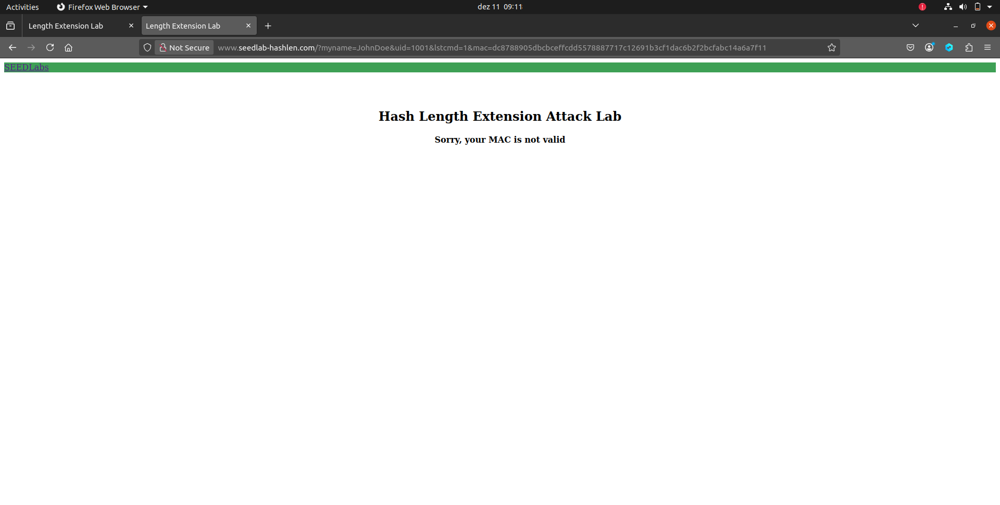
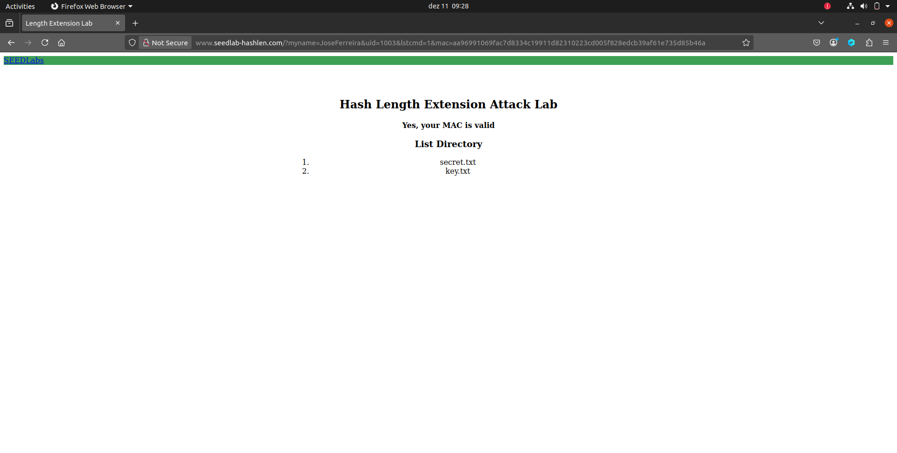

# Logbook 10 - Hash Length Extension Attack Lab

## Task 1: Send Request to List Files

In this task, the goal is to understand how the server behaves when it receives different kinds of requests.

The first thing we tested was simply accessing the server’s webpage after composing a basic request.  
We quickly realized that the server requires a **valid `uid` parameter**; otherwise, it responds with a blank page containing the message:
 `UID argument not found. Aborting`.

This tells us that the server will not continue processing unless `uid` is present and correct among other parameters. So we tried with mock values given in the lab.
Url: `http://www.seedlab-hashlen.com/?myname=JohnDoe&uid=1001&lstcmd=1
mac=dc8788905dbcbceffcdd5578887717c12691b3cf1dac6b2f2bcfabc14a6a7f1`

Which returned the following response:



This makes sense, since the MAC we used earlier was almost certainly miscalculated.  
So our next step is to generate our **own correct MAC** for a valid request to the server.

First, we will use the name of one of our group members: `JoseFerreira`.

Next, we need to obtain the proper `uid:key` pair in order to compute the MAC.  
This is important because, in this lab, the MAC is calculated using the formula:
```
MAC = sha256( k : m )
```


where:

- **m** is the request string (e.g., `myname=JohnDoe&uid=1001&lstcmd=1`)
- **k** is the secret key associated with the selected UID

To make our test slightly different from the lab example, we will use UID **1003**, which has the corresponding secret key **793zye**.

We also want to test the basic `lstcmd` operation, which lists the files on the server.  
So we will set `lstcmd=1`.

**Summary of parameters:**

- `myname=JoseFerreira`  
- `key=793zye`  
- `uid=1003`  
- `lstcmd=1`

To calculate the MAC, the lab instructs us to use `sha256sum`.  
This is why we need the secret key: it ensures we can hash the request in a way that the server will accept.

The string to hash is constructed as:

```
k:R
```

where `k` is the key (`793zye`) and `R` is the full request `myname=JoseFerreira&uid=1003&lstcmd=1`


So the final input to `sha256sum` becomes:

```
793zye:myname=JoseFerreira&uid=1003&lstcmd=1
```

We can compute the MAC by running the following command in Bash:

```
echo "myname=JoseFerreira&uid=1003&lstcmd=1" | sha256sum
```
Although we could use the Bash command directly, it is much easier to experiment with different values using a Python script.  
Because of this, the command we *actually* used for the lab was generated by our Python helper script:

```py
mac_input = f"{key}:{params}"
mac = hashlib.sha256(mac_input.encode()).hexdigest()
```

Generated mac:
```
aa96991069fac7d8334c19911d82310223cd005f828edcb39af61e735d85b46a
```

The final result we got:


It worked! we can finally talk with the server correctly.

***Notes***:
The purpose of the Python script was simply to give us a more flexible way to change values without much effort.  
The script generates the correct MAC and prints the final URL, which we then copied and pasted into the web browser manually.

***Script***:
```py
import hashlib

uids = {
    1001: "123456",
    1002: "983abe",
    1003: "793zye",
    1004: "88zjxc",
    1005: "xciujk",
}

def build_url(name, uid, lstcmd=False):

    if uid not in uids:
        raise ValueError(f"Unknown UID: {uid}")
    
    key = uids[uid]
    
    params = f"myname={name}&uid={uid}"
    if lstcmd:
        params += "&lstcmd=1"
    
    
    mac_input = f"{key}:{params}"
    mac = hashlib.sha256(mac_input.encode()).hexdigest()
    
    
    url = f"http://www.seedlab-hashlen.com/?{params}&mac={mac}"
    return url


name = "JoseFerreira"
uid = 1003


url = build_url(name, uid, lstcmd=True)
print("URL:", url)
```

### Task 2

To explore the hash extension attack, we first need to understand how padding works in SHA‑256.  
SHA‑256 processes data in **64‑byte blocks**, which means the message must be padded so that its length becomes a multiple of 64 bytes.
The padding follows a very specific format. Immediately after the original message, the algorithm appends a special byte `\x80`, which marks the end of the message. After this byte, the message is filled with `\x00` bytes until it is exactly **8 bytes short of a 64‑byte boundary**. 
Why stop 8 bytes before the boundary?  
Because the **last 8 bytes** are reserved for the length of the original message, represented in bits and stored in **big‑endian** format.

With this in mind lets build the padding for our original message:


