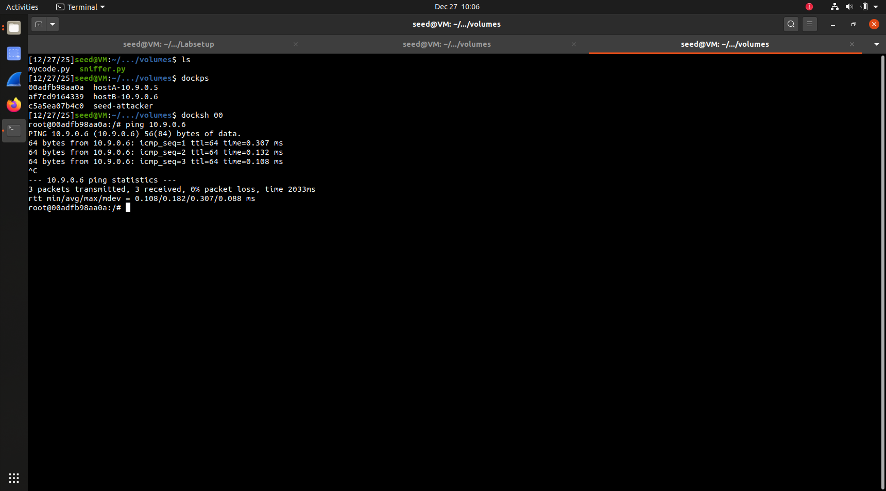
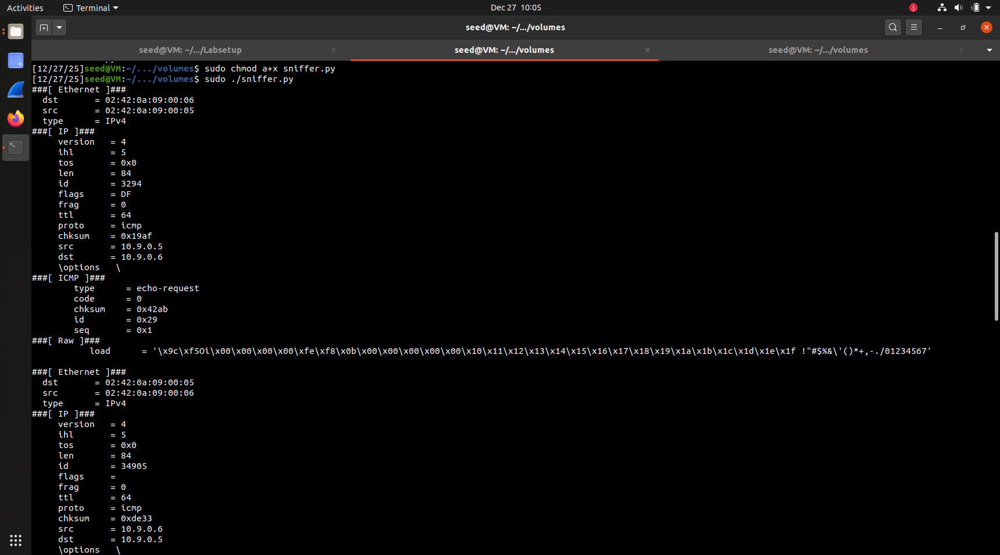
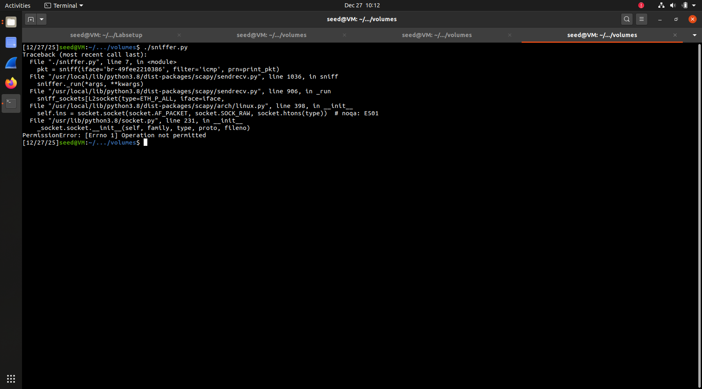
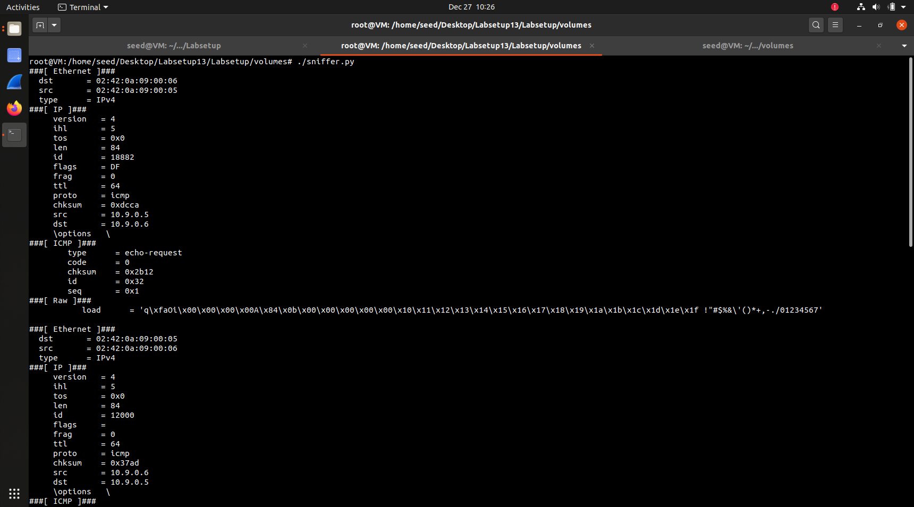
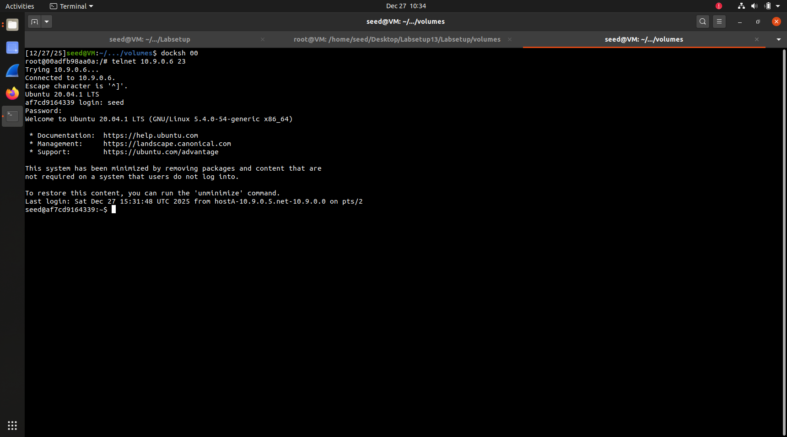
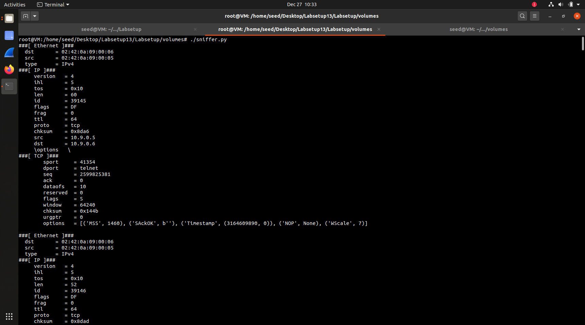
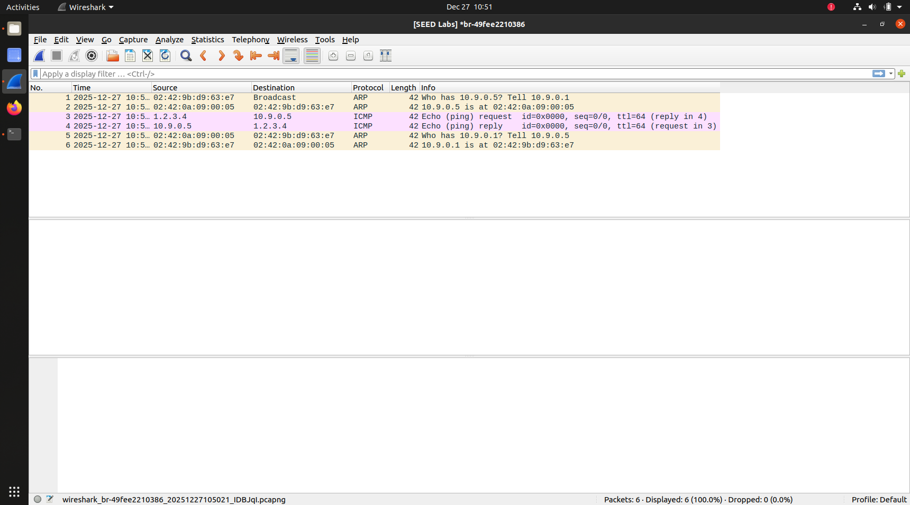
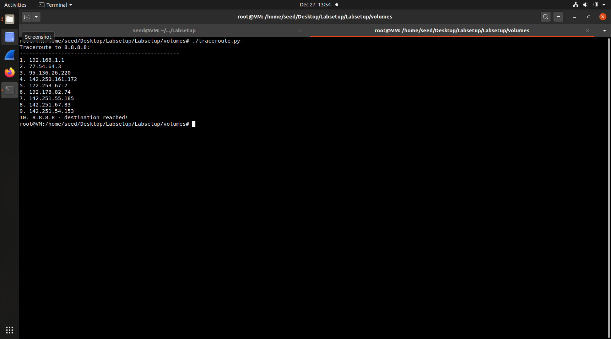

# LOGBOOK 11 - Sniffing and Spoofing Lab

## Task 1.1.A: Os containers hostA e hostB não enviam pacotes por defeito. Para exemplificar esta tarefa, deverá enviar pacotes de dentro de cada container. Demonstre e explique as várias camadas dos pacotes sniffed.

After using the command `dockup` and verifying that the containers where working as expected, we created `sniffer.py`.

Following the guide, we changed the interface in the example with the Host VM one (SEED).

### Sniffer.py
```
#!/usr/bin/env python3
from scapy.all import *

def print_pkt(pkt):
    pkt.show()

pkt = sniff(iface='br-49fee2210386', filter='icmp', prn=print_pkt)
```

### Results
- Ping from Host B


- Scapy ping sniff


- Sniffer error when using without sudo



## Task 1.1B: Deve descobrir qual a sintaxe necessária para os filtros BPF e quais comandos a executar para enviar os pacotes desejados.

As the code from the guide already had the icmp filter in the line `pkt = sniff(iface='br-49fee2210386', filter='icmp', prn=print_pkt)`, we got a tip on how to configure


- Result with icmp filter (that was there by default)



- Result then updating the filter to`filter='tcp and src host 10.9.0.5 and dst port 23'`






## Task 1.2: Garanta que corre o wireshark com permissões de root.





## Task 1.3: Escolha algum IP externo, como por exemplo 8.8.8.8.

- traceroute.py

```

#!/usr/bin/env python3
from scapy.all import *

destination = '8.8.8.8'
max_hops = 30

print(f"Traceroute to {destination}:")
print("-" * 50)

for ttl in range(1, max_hops + 1):
    pkt = IP(dst=destination, ttl=ttl) / ICMP()
    
    reply = sr1(pkt, verbose=0, timeout=2)
    
    if reply is None:
        print(f"{ttl}. * * * (no answer)")
    elif reply.type == 0:
        print(f"{ttl}. {reply.src} - destination reached!")
        break
    else:
        print(f"{ttl}. {reply.src}")

```

When trying to use traceroute internally, through the VirtualBox VM we always get the same result of one hop.

The traceroute shows only 1 hop because the VM uses NAT networking. The NAT gateway handles routing externally, hiding intermediate routers. The code correctly implements traceroute by incrementing TTL values, but the network configuration limits visibility. Running traceroute 8.8.8.8 from the host system confirms this limitation

When running it outside of the VM we get the expected result

```
Traceroute to 8.8.8.8:
--------------------------------------------------
1. 192.168.1.254
2. 10.194.192.1
3. * * * (no answer)
4. 195.8.30.245
5. 72.14.203.24
6. 192.178.246.149
7. 192.178.82.76
8. 142.251.55.191
9. 108.170.226.235
10. 142.250.232.11
11. 8.8.8.8 - destination reached!
```

From this we can see all the hops necessary to reach 8.8.8.8

We changed the configuration of the VM network from NAT to bridge, making it also work inside the SEED environment (notice that we ran the command from another machine).



From this we understood that by changing the ttl configuration it is possible to get a return from every hop point in the path to a certain ip destination.

## Task 1.4: Primeiro descubra como sniffar e filtrar ICMP echo requests, lembrando-se da Task 1.1. Num dos containers, pode enviar ICMP echo requests com o comando ping. Depois envie o pacote de resposta adaptando as soluções das Task 1.2 e 1.3.


python code:

```
#!/usr/bin/env python3
from scapy.all import *

def spoof_reply(pkt):
    if ICMP in pkt and pkt[ICMP].type == 8: 
        print(f"ICMP Request capturado: {pkt[IP].src} -> {pkt[IP].dst}")

        ip = IP(src=pkt[IP].dst, dst=pkt[IP].src)
        icmp = ICMP(type=0, id=pkt[ICMP].id, seq=pkt[ICMP].seq)

        if Raw in pkt:
            data = pkt[Raw].load
            spoofed_pkt = ip/icmp/data
        else:
            spoofed_pkt = ip/icmp

        send(spoofed_pkt, verbose=0)
        print(f"ICMP Reply spoofed enviado: {spoofed_pkt[IP].src} -> {spoofed_pkt[IP].dst}")

print("A aguardar ICMP requests...")
sniff(iface='br-c93733e9f913', filter='icmp[icmptype] == 8', prn=spoof_reply)
```
